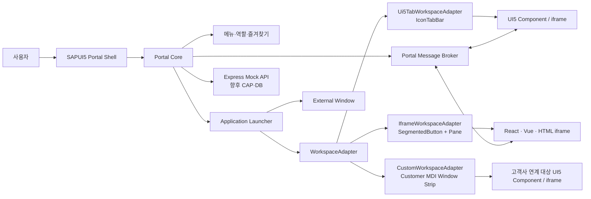

# 전체 시스템 아키텍처



## 모듈별 책임

| 모듈 | 책임 |
| --- | --- |
| Portal Shell | Header, 탐색, 역할·어댑터 선택, Workspace 호스트 영역 |
| Portal Core | 메뉴·권한 필터, 즐겨찾기·최근 실행, Adapter 선택, 앱 실행 조정 |
| Application Launcher | `applicationType`별 실행 분기와 파라미터 정규화 |
| WorkspaceAdapter | 앱 열기·닫기·활성화·메시지 전달을 Portal Core에서 분리 |
| Workspace Container | Adapter가 소유하는 실제 탭/창 UI와 콘텐츠 배치 |
| Message Broker | 공통 Envelope 검증·표시 및 EventBus/postMessage bridge |
| Express Mock API | 사용자, 메뉴, 애플리케이션, 즐겨찾기, 최근 실행, 구매 프로세스 Mock |
| Admin UI | 메뉴·앱 설정을 위한 Mock CRUD 화면 |

## 데이터 모델

`ApplicationConfig`는 `id`, `title`, `description`, `icon`, `applicationType`, `target`, `navigationMode`, `roles`, `parameters`, `active`를 가진다.

`MenuItem`은 `id`, `parentId`, `title`, `description`, `icon`, `order`, `applicationId`, `roles`, `active`를 가진다. 메뉴 트리는 `parentId`로 구성하고, 역할 필터 후 순서대로 표시한다. 추가 Mock 엔터티는 `User`, `Role`, `Favorite`, `RecentLaunch`, 구매요청과 승인 이력이다.

현재 데이터는 서버 메모리에만 있으므로 서버 재시작 또는 재배포 시 초기화된다.

## WorkspaceAdapter 설계

Portal Core는 구체적인 탭 컨트롤을 알지 못하고 아래 계약만 사용한다.

```ts
interface WorkspaceAdapter {
  open(application: ApplicationConfig): void;
  close(instanceId: string): void;
  closeAll(): void;
  activate(instanceId: string): void;
  sendMessage(message: PortalMessage): void;
  getOpenedApplications(): OpenedApplication[];
  getWorkspaceControl(): Control | undefined;
  getActiveControl(): Control | undefined;
}
```

| Adapter | 실제 Workspace UI | 용도와 제약 |
| --- | --- | --- |
| `Ui5TabWorkspaceAdapter` | `AdapterTabContainer`의 SAPUI5 `IconTabBar` | 기본 통합 Workspace. UI5 Component와 iframe을 함께 실행 |
| `IframeWorkspaceAdapter` | `IframeWorkspaceContainer`의 `SegmentedButton` + 콘텐츠 Pane | URL 기반 iframe 앱 전용. React/Vue/HTML/Nexacro 웹 URL 검증 |
| `CustomWorkspaceAdapter` | `CustomerMdiWorkspaceContainer`의 `FlexBox` 창 스트립 + 콘텐츠 Pane | 고객사 MDI 컨트롤을 대체할 확장 위치를 보여 주는 참조 구현 |

세 Adapter는 같은 인터페이스를 공유하지만, 실제 컨테이너 Control과 탭 표시 방식은 서로 다르다. `CUSTOM`의 보라색 창 스트립은 고객사 SDK 연계가 아닌 시각적·구조적 예시이며, 실제 구축에서는 고객사 Control API를 감싼 새 Adapter로 교체한다.

## 메시지 송수신 구조

```ts
interface PortalMessage {
  messageId: string;
  source: string;
  target: string;
  eventType: string;
  payload: unknown;
  timestamp: string;
}
```

- UI5 Component: UI5 `EventBus`를 통해 Portal과 앱이 이벤트를 주고받는다.
- iframe: `postMessage`로 Envelope을 전달한다. PoC는 같은 Origin의 샘플 앱을 대상으로 한다.
- 앱 간 통신: sender → Broker → target 앱 순서로 전달한다.

운영 전환 시에는 UUID 생성, payload schema 검증, 대상 앱 권한 검사, origin allow-list, 감사 로그를 추가해야 한다.

## 구현 상태와 후속 단계

완료된 PoC는 Shell, 역할 필터, 다중 Workspace, 앱 실행, 메시지 시연, Mock 관리자 기능, CF Trial 배포다. 운영 전환에는 XSUAA/IAS, Destination/Connectivity, DB와 API, 고객사 SSO, 실제 고객 MDI Adapter, 모니터링·감사 로그가 필요하다.
