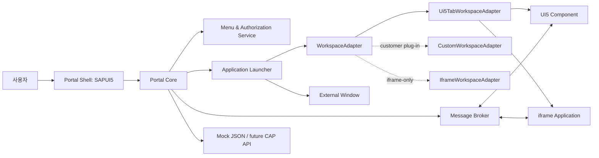

# 전체 시스템 아키텍처



## 모듈별 책임

| 모듈 | 책임 |
|---|---|
| Portal Shell | Header, 탐색, Workspace 영역, 사용자 컨텍스트 UI |
| Portal Core | 메뉴 조회/권한 필터, 즐겨찾기·최근 이력, 실행 오케스트레이션 |
| Application Launcher | applicationType에 따른 실행 위임과 파라미터 정규화 |
| WorkspaceAdapter | 탭/창의 생성, 활성화, 종료를 Portal Core에서 분리 |
| Message Broker | 공통 envelope 검증, 라우팅, EventBus/postMessage bridge |
| Admin API/UI | 메뉴·앱·권한·활성화 설정 CRUD (1단계는 Mock 모델) |
| Workspace Adapter 구현 | 고객별 MDI/Tab Container 종속성 캡슐화 |

## 데이터 모델

`ApplicationConfig`: `id`, `title`, `description`, `icon`, `applicationType`, `target`, `navigationMode`, `roles`, `parameters`, `active`.

`MenuItem`: `id`, `parentId`, `title`, `description`, `icon`, `order`, `applicationId`, `roles`, `active`. 트리는 `parentId`로 구성하며, UI는 권한 필터 후 정렬한다. 추가 엔터티는 `User`, `Role`, `UserRole`, `Favorite(userId, applicationId)`, `RecentLaunch(userId, applicationId, launchedAt)`이다.

## WorkspaceAdapter 설계

`WorkspaceAdapter`는 `open`, `close`, `closeAll`, `activate`, `sendMessage`, `getOpenedApplications`를 고정 계약으로 둔다. Core는 구현체가 UI5 탭인지 고객 MDI인지 알지 못한다. 1단계의 `Ui5TabWorkspaceAdapter`는 `IconTabBar`에 표시할 열린 앱 목록과 활성 Control을 관리한다.

## 메시지 송수신 구조

공통 envelope은 아래 형식이다.

```ts
interface PortalMessage {
  messageId: string; source: string; target: string;
  eventType: string; payload: unknown; timestamp: string;
}
```

- UI5 Component: `sap.ui.getCore().getEventBus()`를 bridge가 구독/발행한다.
- iframe: 허용된 origin만 대상으로 `window.postMessage(envelope, origin)`하고, 수신 시 origin·schema·target을 검증한다.
- Application-to-Application: sender → Broker → target Adapter/bridge 순서이며 `target: "*"`는 권한이 있는 broadcast에만 허용한다.
- 운영 전환 시 메시지 ID는 UUID, payload는 JSON schema, 감사 로그에는 메타데이터만 저장한다.

## 단계별 개발 계획

1. **완료 — Foundation**: Shell, JSON Mock, 역할 필터, 기본 탭 Adapter, UI5 샘플.
2. **Application runtime**: 실제 독립 UI5 component 로딩, iframe origin allow-list, custom handler registry, 메시지 broker.
3. **관리/보안**: CAP/Express API, 메뉴 편집 화면, XSUAA JWT role mapping, audit.
4. **BTP 통합**: Destination, approuter, HTML5 Apps Repository/Build Work Zone, CI/CD.
5. **고객 적용**: customer WorkspaceAdapter, SSO/브랜딩, 기존 포털 메뉴 마이그레이션, 성능·보안 검증.
