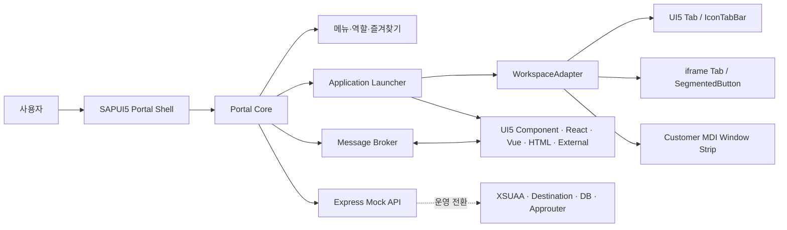

# SAP Enterprise Portal EOS 대응 솔루션 개념설계

## 추진 배경과 목적

SAP Enterprise Portal End of Service에 대응해 SAP와 Non-SAP 업무를 통합 실행할 수 있는 Portal 솔루션의 공통 기술 기반을 검증한다. 1차 대상은 인포데이에서 제시한 **SAPUI5 기반 고전형 Portal(MDI 포함)**이다.

이 PoC는 특정 고객사의 MDI를 직접 대체하지 않는다. Portal Core를 공통화하고, 고객사의 Tab Container 또는 MDI Control은 Adapter로 바꿔 끼울 수 있는 구조를 검증한다.

## 고객 요구 분류와 대응

| 구분 | 고객 요구 | 대응 방향 | PoC 적용 |
| --- | --- | --- | --- |
| Non-SAP | React/Vue 기반 업무 | iframe, 새 창, 고객 Handler로 통합 | React/Vue iframe 실제 시연 |
| Non-SAP | Nexacro | 라이선스·배포·보안 정책 확인 후 iframe 또는 전용 Adapter | 구조만 수용, 실제 제품 연계는 미구현 |
| SAP | Launchpad/Work Zone, MDI 불필요 | Launchpad/Work Zone 중심 경량 Portal | 후속 제품 옵션 |
| SAP | UI5 고전형 Portal, MDI 필요 | SAPUI5 Shell + WorkspaceAdapter | **현재 PoC 핵심 범위** |

## 목표 구조

## 현재 검증 결과

- SAPUI5 Shell 안에서 다수 업무 앱을 열고, 재활성화·현재 탭 닫기·전체 닫기를 수행한다.
- UI5 Component, HTML iframe, React iframe, Vue iframe, 새 창 실행을 같은 애플리케이션 설정 모델로 실행한다.
- 역할에 따라 메뉴와 실행 가능 앱을 필터링한다.
- UI5 EventBus와 iframe `postMessage`를 공통 Message Envelope으로 연결한다.
- 세 Adapter가 서로 다른 Workspace 컨트롤을 소유하도록 구현했다.
- 구매요청 등록 → 예산검토 → 승인이라는 시연용 업무 흐름을 Mock 데이터로 제공한다.
- SAP BTP Cloud Foundry Trial 배포와 로컬 실행을 확인했다.

## MDI 핵심 설계

MDI는 단순히 탭 모양의 UI가 아니라 한 Portal 안에서 여러 업무 애플리케이션의 실행 상태와 전환을 관리하는 모델이다. PoC에서 MDI의 공통 계약은 `open`, `close`, `closeAll`, `activate`, `sendMessage`, `getOpenedApplications`이다.

현재 기본 Adapter는 SAPUI5 `IconTabBar`를 사용한다. iframe Adapter는 Non-SAP에 맞게 `SegmentedButton`과 단일 콘텐츠 Pane을 사용하고, Custom Adapter는 고객사 창 스트립을 모사한 `FlexBox` 컨테이너를 사용한다. 실제 고객사 UI5 커스텀 컨트롤을 적용할 때는 그 Control의 API에 맞춘 별도 Adapter를 개발한다.

## 운영 전환 우선순위

1. 고객별 메뉴·권한·대상 업무와 MDI Control API를 확정한다.
2. XSUAA/IAS 또는 고객사 SSO와 실제 역할 검증을 적용한다.
3. 메뉴·즐겨찾기·업무 데이터를 DB 및 API로 전환한다.
4. S/4HANA/ECC OData, Non-SAP API, Destination/Connectivity를 연계한다.
5. 고객사 Adapter의 lifecycle, 성능, 보안, 장애 처리를 검증한다.
6. 모니터링, 감사 로그, 배포 파이프라인을 구성한다.
