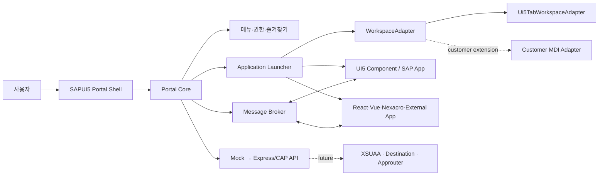

# SAP Enterprise Portal EOS 대응 솔루션 개념설계

## 1. 추진 배경과 목표

SAP Enterprise Portal End of Service에 따라 한전KDN, 현대중공업, 한국수력원자력 등 고객의 Portal 대체 문의가 증가하고 있다. 고객은 단순 UI 재구축이 아니라 SAP 및 Non-SAP 업무를 한 화면에서 안전하게 실행·관리할 수 있는 솔루션을 요구한다.

본 과제의 1차 목표는 인포데이에서 발표한 **SAPUI5 기반 고전형 Enterprise Portal 솔루션(MDI 포함)**을 제품화 가능한 공통 Framework로 개념설계·검증하는 것이다. 특정 고객사의 MDI를 복제하지 않으며, 고객별 Tab Container는 Adapter로 수용한다.

## 2. 고객 요구 분류와 대응 전략

| 구분 | 고객 요구 | 대응 방향 | 본 과제와의 관계 |
|---|---|---|---|
| Non-SAP | React/Vue 기반 업무, 블루어드 구현 | iframe·새 창·Custom Handler를 통한 통합 실행 | 공통 실행 모델로 수용 |
| Non-SAP | Nexacro 업무, 라이선스/이젠고 협력 검토 | 독립 기술·라이선스 검토 후 iframe 또는 전용 Adapter 결정 | 별도 사업성 판단 필요 |
| SAP | SAP Launchpad 활용, MDI 불필요 | SAP Build Work Zone/Launchpad 연계 아키텍처 | 경량 Portal 옵션 |
| SAP | UI5 고전형 Portal, MDI 필요 | SAPUI5 Shell + WorkspaceAdapter + UI5 Tab Workspace | **1차 솔루션 개발 범위** |

핵심 원칙은 Portal Core를 공통화하고, 화면 Workspace·애플리케이션 연결·인증을 고객별 조합으로 제공하는 것이다.

## 3. 목표 솔루션 구조

## 4. 솔루션 기능 범위

### 공통 Portal Core

- 역할 기반 계층 메뉴, 메뉴 검색, 즐겨찾기, 최근 실행
- 사용자·권한·메뉴·애플리케이션 설정 모델
- UI5 Component, iframe, 새 창, Custom Handler의 표준 실행 계약
- 공통 메시지 Envelope와 EventBus/postMessage bridge
- 고객별 Workspace Adapter 주입 구조

### UI5 고전형 Portal 옵션

- Header, Side Navigation, 중앙 MDI Workspace
- 탭 열기·활성화·개별 닫기·전체 닫기·중복 실행 정책
- UI5 Component를 Workspace 탭에 독립 실행
- 고객 MDI SDK를 감싼 `CustomWorkspaceAdapter` 확장

### 후속 솔루션 옵션

- Launchpad/Work Zone형: MDI가 필요 없는 고객 대상의 경량 Portal
- Non-SAP 통합형: React/Vue/Nexacro를 iframe·새 창·전용 Adapter로 연결

## 5. 단계별 개발 및 검증 기준

| 단계 | 구현 결과 | 사업/기술 검증 기준 |
|---|---|---|
| 1. Foundation | Shell, Mock 메뉴·권한, UI5 Tab Workspace | UI5 고전형 포털 UX와 공통 메뉴 모델 시연 |
| 2. Runtime & Messaging | 실제 앱 실행기, Broker, iframe 보안 | SAP·Non-SAP 앱을 같은 계약으로 실행·통신 |
| 3. Admin & API | 메뉴/앱 관리, Express/CAP API, 감사 모델 | 고객별 메뉴·권한 설정을 코드 수정 없이 관리 |
| 4. Security & BTP | XSUAA, Destination, approuter, CF 배포 | BTP 운영환경에서 인증·백엔드 연계 가능 |
| 5. Customer Adapter | 고객 MDI/탭 컨테이너 Adapter | Core 변경 없이 고객 Workspace 대체 |

## 6. 2단계 우선 백로그

1. `WorkspaceAdapter`에 탭별 close 및 active-change 이벤트를 추가하고 `Ui5TabWorkspaceAdapter`에 적용한다.
2. `ApplicationLauncher`와 `CustomHandlerRegistry`를 분리한다.
3. `PortalMessage`의 ID 생성·schema 검증·수신자 라우팅을 구현한다.
4. iframe origin allow-list, sandbox, postMessage handshake를 구현한다.
5. 독립 UI5 샘플 앱에서 Portal EventBus 메시지를 송수신하는 시나리오를 구현한다.
6. 각 실행 유형의 성공/실패 상태를 Workspace에 표시한다.

## 7. 의사결정 필요 항목

- Nexacro 통합의 범위와 이젠고 협력/라이선스 전략
- Launchpad/Work Zone형을 별도 제품 옵션으로 제공할지 여부
- 고객 MDI Adapter에 필요한 최소 SDK 계약
- Portal 관리 API의 CAP 채택 여부와 운영 데이터 저장소
- XSUAA 역할 체계와 고객 LDAP/IdP 연계 방식
